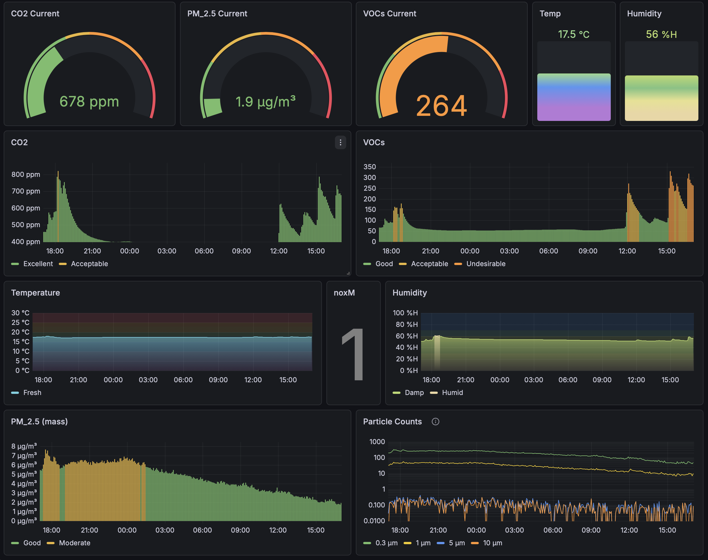

# relay-airgradient.py

## Purpose

The script `relay-airgradient.py` transfers air quality measurement data from
an AirGradient device's [local
API](https://github.com/airgradienthq/arduino/blob/master/docs/local-server.md)
to InfluxDB (V2 or later) for time-series storage and analysis. This script
can be run on any device on your local network where you can install
Python. The Airgradient itself does not need a cloud connection, nor do you
need to modify the firmware.


## Features

- **Windowed Averaging**: Collects multiple samples and posts their average to
  InfluxDB, reducing noise and database load. Sampling and averaging periods
  are configurable.
- **Consistent Sampling Interval**: Collects samples at precise time
  intervals, accounting for network latency to maintain accurate timing.
- **Robust Error Handling**: Failed data retrievals and InfluxDB submissions
  are tolerated. Failed InfluxDB posts are queued for retry on the next
  successful connection, ensuring no data loss during internet disruptions.

### Non-features and TODOs

- Deployment, monitoring, and high availability measures such as restart on
  failure are left to the user.
- Tests are desirable but not implemented yet.
- Config file support
- File-based persistence for the Influx queue could be considered.


## Requirements

- Python 3.7+
- Python requests library

- Airgradient device
- InfluxDB instance (V2 or above)


## Usage

```bash
INFLUX_TOKEN=xxx ./relay-airgradient.py <influx_host>/<influx_org>/<influx_bucket> <airgradient_host> loc:<location> <n*period_sec> led:LL/HHMM-HHMM/LL disp:LL/HHMM-HHMM/LL
```

### Arguments

All arguments are required and can be specified in any order:

- `<influx_host>/<influx_org>/<influx_bucket>`: InfluxDB host, organization,
  and bucket (e.g., `influx.example.com/my-org/my-bucket`)
- `<airgradient_host>`: Hostname or IP of the AirGradient device (e.g.,
  `airgradient.local`)
- `loc:<location>`: Location tag for the measurements (e.g., `loc:bedroom`)
- `<n*period_sec>`: Sampling configuration where `n` is the number of samples
  and `period_sec` is the interval in seconds between samples (e.g., `5*60`
  collects 5 samples at 60-second intervals, posts the average every 5 minutes)
- `led:LL/HHMM-HHMM/LL` and `disp:LL/HHMM-HHMM/LL` set the LED and display
   brightness adjustment schedule.

### Light schedule

The Airgradient cloud service manages a daily schedule for adjusting the LED
bar and display brightness. This is not implemented on the device itself. If
you want to disconnect your device from the cloud you need to either do
without this feature, use a home automation system, or implement it
yourself. If you don't have a home automation system this script can handle
it.

The `led:` argument sets the daytime period and the nighttime and daytime
brightness for the LED bar. The `disp:` argument sets the nighttime and
daytime brightness for the text display and the period to turn the display
off for longevity purposes.

To disable this feature, set the daytime and off periods to 0 length:

    led:20/1100-1100/100 disp:10/1100-1100/100

The levels are ignored and the exact time doesn't matter as long as start =
end for both values.

### Example

```bash
export INFLUX_TOKEN="your-influx-api-token"
./relay-airgradient.py influx.example.com/my-org/sensors airgradient.local loc:bedroom 5*60 led:20/0800-2000/100 disp:10/0200-0300/100
```

This will:
- Poll the AirGradient device every 60 seconds
- Collect 5 samples (5 minutes total)
- Calculate the average of all measurements
- Post the averaged data to InfluxDB with a timestamp at the midpoint of the
  collection window
- Adjust the LED and display brightness according to the default schedule of
  Airgradient cloud
- Repeat indefinitely

This could be run on a router, NAS, Raspberry pi, etc. with `nohup` or through
a startup / systemd script.


## Logging

The script logs to stdout with timestamps and severity levels. Debug logging
can be enabled by modifying the logging configuration.


## Customization

Adjust the `convert_data()` function according to your desired schema in
InfluxDB.


## Visualization

An importable Grafana dashboard set up for InfluxDB 3.x and the data mapping
implemented in the script is [included](./airgradient-dashboard.json). It
assumes there is a data source set up in Grafana pointing to the Influx
bucket.

### Dashboard Notes

The gauges across the top show current state regardless of what the dashboard
time range is set to.

Color schemes for the CO2, VOCs, and PM 2.5 time series follow what the
Airgradient official dashboards used in December 2025.

The NOX reading is the maximum observed over the dashboard time range.

The particle counts are shown on a log scale.



